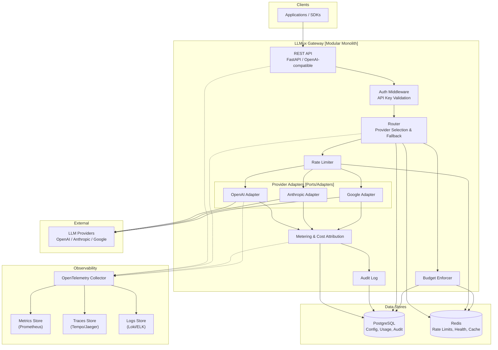
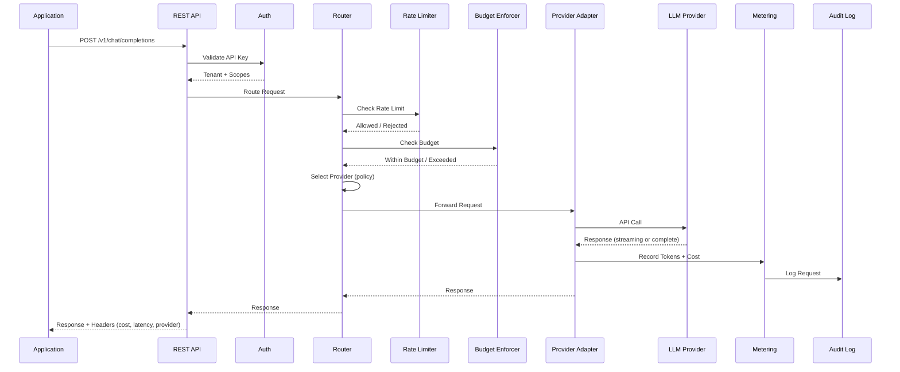
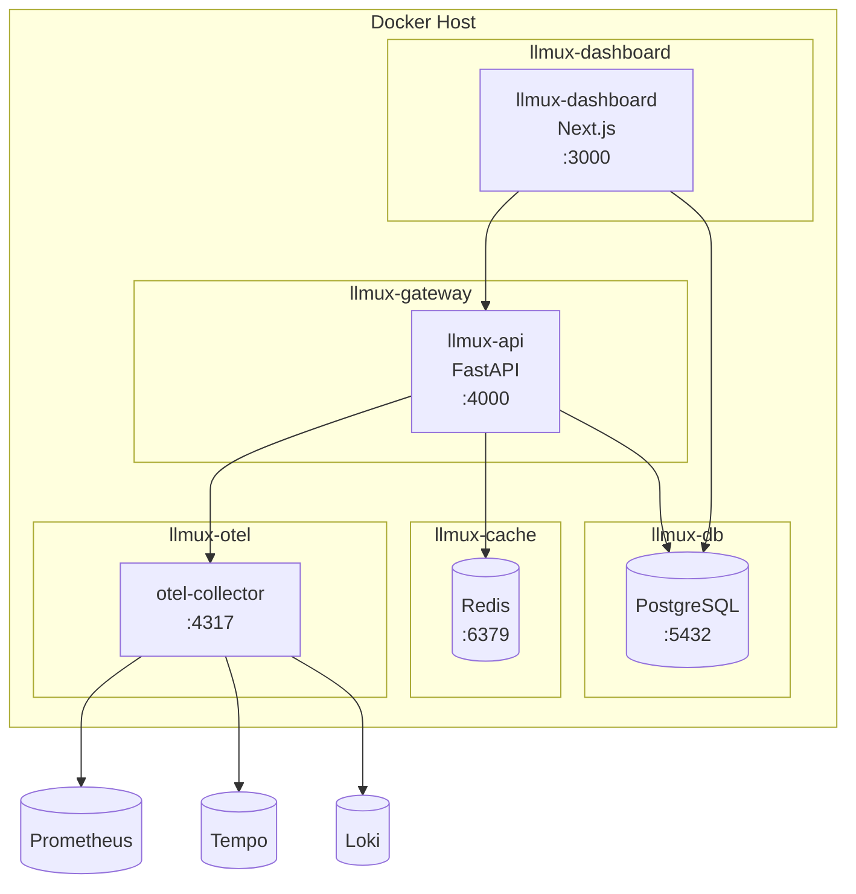

# ARCHITECTURE.md

> **Status**: Proposed | **Last updated**: 2026-07-17 | **Author**: Jonathan Soto

## Section Map

| Section | Purpose |
|---------|---------|
| System Overview | One-paragraph elevator pitch |
| Architecture Pattern | Modular monolith with ports/adapters — decision and alternatives |
| Architecture Views & Diagrams | Mermaid diagrams (system, sequence, deployment) |
| Component Details | Per-component: tech, responsibility, scaling, deps, failure modes |
| Data Architecture | PostgreSQL, Redis, caching strategy |
| API Architecture | REST, OpenAI-compatible, statelessness, auth, errors, rate limits |
| Non-Functional Requirements | Measurable targets for all categories |
| Key Decisions | Table of decisions, rationale, alternatives |
| Resilience & Performance | Applied techniques table |
| Failure Modes & Mitigations | At least 3 failure modes |
| Scaling Strategy | Current vs future growth plan |
| ADRs | Links to ADRs |

## System Overview

LLMux is an observable multi-provider LLM gateway. Applications send requests to a single OpenAI-compatible REST API; the gateway routes them to the best available provider based on policy, tracks cost and usage per tenant, and emits OpenTelemetry traces, metrics, and structured logs. It is built as a modular monolith with ports/adapters architecture — each provider integration is a pluggable adapter behind a stable interface, and internal modules (routing, metering, audit, rate limiting) communicate through clear boundaries without network calls. The system uses PostgreSQL for durable state and Redis for rate limiting, caching, and health state.

## Architecture Pattern

**Chosen pattern**: Modular Monolith with Ports & Adapters (Hexagonal Architecture)

**Why this pattern**:

LLMux has clear bounded contexts (routing, metering, provider interaction, audit, rate limiting) that benefit from enforced boundaries, but the team size and operational capacity don't warrant separate deployments. The ports/adapters pattern lets us define stable interfaces for provider interactions, storage, and observability — making each adapter independently testable and replaceable. If any module later needs independent scaling (e.g., metering writes saturate the DB), it can be extracted to a service without rewriting the core logic.

**Alternatives evaluated**:

- **Microservices**: Rejected — team is 1-3 people initially; operational complexity of running multiple services (N+1 databases, service discovery, inter-service auth, deployment coordination) would dominate development time without evidence that independent scaling is needed. Reserved for post-MVP if specific modules demonstrate independent scaling requirements.
- **Layered (MVC) monolith**: Rejected — provider adapters, metering, routing, and audit have cross-cutting concerns (observability, auth) that layered architectures handle poorly. Ports/adapters provide better testability and clearer boundaries without the extraction cost of microservices.
- **Serverless / Functions**: Rejected — streaming LLM responses require long-running connections (minutes per request); request-response latency targets (< 50ms gateway overhead) favor warm processes; rate-limit state and cost aggregation benefit from shared in-memory state.

## Architecture Views & Diagrams

### System Architecture Diagram

### Request Flow Sequence

### Deployment Diagram

## Component Details

### REST API (FastAPI)

- **Technology**: Python 3.12+, FastAPI
- **Responsibility**: Expose OpenAI-compatible REST endpoints, validate API keys, parse and validate request payloads, return responses with cost/latency headers
- **Scaling**: Horizontal via multiple FastAPI workers behind a reverse proxy
- **Dependencies**: Auth middleware, Router, OpenTelemetry SDK
- **Failure modes**: Request validation failure → 400 error; auth failure → 401; upstream timeout → 504

### Router

- **Technology**: Python (core module)
- **Responsibility**: Select provider based on policy (priority, latency, cost); manage fallback chain on failure; maintain health state per provider
- **Scaling**: Stateless; scales with FastAPI workers
- **Dependencies**: Provider adapters, PostgreSQL (provider config), Redis (health state), Rate Limiter
- **Failure modes**: All providers unhealthy → 503; policy misconfiguration → fallback to default

### Provider Adapters

- **Technology**: Python (one class per provider, shared interface)
- **Responsibility**: Translate gateway request to provider-specific API call; normalize response; report token usage; handle provider-specific errors
- **Scaling**: Stateless; scales with FastAPI workers
- **Dependencies**: HTTP client (httpx), provider SDK or raw REST
- **Failure modes**: Provider API change → adapter must be updated; provider outage → router triggers fallback; authentication error → clear error propagated

### Metering

- **Technology**: Python (core module, async DB writes)
- **Responsibility**: Calculate cost from token counts; record usage per request; aggregate for dashboard queries
- **Scaling**: Write path via async queue to batch DB writes; read path scales with dashboard workers
- **Dependencies**: PostgreSQL, provider adapter (returns token counts)
- **Failure modes**: DB write failure → usage data in memory buffer; buffer overflow → data loss (acceptable for MVP with alerting)

### Auth Middleware

- **Technology**: Python (FastAPI middleware)
- **Responsibility**: Extract API key from Authorization header; validate against PostgreSQL; resolve tenant and scopes
- **Scaling**: Stateless; with Redis cache for validated keys
- **Dependencies**: PostgreSQL (key lookup), Redis (cache)
- **Failure modes**: DB unreachable → auth degraded (cached keys only); invalid key → 401

### Rate Limiter

- **Technology**: Python + Redis (sliding window)
- **Responsibility**: Enforce per-key and per-tenant rate limits
- **Scaling**: Redis-backed; horizontal workers share Redis counter state
- **Dependencies**: Redis
- **Failure modes**: Redis unavailable → allow all requests (fail-open, with alert)

### Budget Enforcer

- **Technology**: Python (core module)
- **Responsibility**: Track spend per billing period; reject or warn when budget threshold is exceeded
- **Scaling**: Redis for current period cache; PostgreSQL for authoritative totals
- **Dependencies**: PostgreSQL, Redis
- **Failure modes**: DB unavailable → use cached budget data (potentially stale); reject decision on unknown budget state → deny-safe default

### Admin Dashboard

- **Technology**: Next.js 15+, TypeScript, Tailwind CSS
- **Responsibility**: Provider health view, usage charts, cost breakdowns, audit log viewer, configuration management
- **Scaling**: Static export or Node.js server; scales independently
- **Dependencies**: Gateway REST API (admin endpoints), PostgreSQL (read-only)
- **Failure modes**: Gateway down → no live data, show cached; PostgreSQL replica lag → slightly stale data

## Data Architecture

### Database Selection

| Database | Type | Purpose | Rationale |
|----------|------|---------|-----------|
| PostgreSQL | Relational | Provider config, API keys, usage records, audit log, budget state | Mature, strong consistency, JSON support for flexible provider config, well-understood operational characteristics |
| Redis | KV / Cache | Rate limit counters, health state, budget period cache, validated API key cache | Sub-millisecond reads, TTL-based expiry, atomic counters for rate limiting |

### Data Model Overview

Key entities (planned):

- **tenants** — id, name, slug, is_active, created_at
- **api_keys** — id, tenant_id, key_hash, key_prefix, label, scopes, expires_at, created_at
- **providers** — id, name, slug, adapter_type, base_url, config (JSONB), is_enabled, created_at
- **routing_policies** — id, name, rules (JSONB), priority, created_at
- **usage_records** — id, request_id, tenant_id, api_key_id, provider_id, model, prompt_tokens, completion_tokens, total_tokens, cost, latency_ms, status, created_at
- **budgets** — id, tenant_id, amount, period (monthly/quarterly), current_spend, reset_at, created_at
- **audit_log** — id, request_id, tenant_id, api_key_id, provider_id, model, request_summary, response_summary, ip_address, user_agent, created_at (append-only)
- **health_checks** — id, provider_id, status, latency_ms, error, checked_at

### Caching Strategy

| What is cached | Where | TTL | Invalidation |
|---------------|-------|-----|-------------|
| Validated API keys | Redis | 5 minutes | On key revocation event (TTL expiry) |
| Provider configuration | Redis | 1 minute | On config update event |
| Health state | Redis | 30 seconds | Per health check interval |
| Budget current period spend | Redis | 1 minute | On usage record insert |
| Rate limit counters | Redis | Sliding window | Per request (INCR + EXPIRE) |
| Dashboard query results | Redis (optional) | 1-5 minutes | On data mutation |

## API Architecture

### API Contract

- **Style**: REST (OpenAI-compatible)
- **Contract**: OpenAI `/v1/chat/completions` schema — structured to be a drop-in replacement
- **Style decision**: REST chosen because the primary interface is resource-oriented (completions, models) and OpenAI compatibility requires REST. GraphQL adds overhead without benefit for a proxy gateway.
- **Consumers**: Application SDKs, admin dashboard, curl/HTTP clients

### API Quality Checklist

- Stateless across application instances: Yes
- Versioning strategy: URL path (`/v1/`) — follow OpenAI convention for compatibility
- Authentication: Bearer token (API key in `Authorization` header)
- Authorization model: RBAC (tenant + scopes per API key)
- Error envelope: OpenAI-compatible error format
- Pagination/filtering/sorting: Cursor-based for list endpoints
- Idempotency: POST `/v1/chat/completions` — planned (Phase 3 / production hardening)
- Rate limiting: Per API key and per tenant; returns `X-RateLimit-*` headers
- API Gateway: Not used beyond LLMux itself; intended to run behind a reverse proxy (nginx/Caddy) for TLS termination

## Non-Functional Requirements

### Performance

- Gateway overhead (inbound → outbound, excluding provider latency): < 10ms p50, < 50ms p95
- API response time (non-streaming, including provider): depends on provider; target < 2s p95 for simple models
- Database query time (usage read): < 100ms p95

### Scalability

- Concurrent requests: 100 (MVP), 1,000 (v1)
- Requests per second: 50 (MVP), 500 (v1)
- Usage data volume: ~1KB per request; 50M requests = ~50GB/year
- Growth rate: target 3x/year after launch

### Availability

- Target: 99.5% (excluding provider downtime)
- RPO: 1 minute (usage data in PostgreSQL)
- RTO: 15 minutes (Docker Compose restart)

### Reliability

- Backup frequency: Daily PostgreSQL dump
- Disaster recovery: Point-in-time recovery from WAL archives

### Security

- Authentication: API key (Bearer token, hashed with bcrypt)
- Authorization: Scoped API keys with tenant isolation
- Compliance: SOC2-type controls documented (not audited pre-MVP); GDPR data locality via deployment region
- Encryption: at rest (PostgreSQL TDE / filesystem encryption), in transit (TLS 1.3)

### Observability

- Logging: Structured JSON (OpenTelemetry-compatible), stdout
- Metrics: OpenTelemetry metrics — request count, latency histogram, token count, cost, error rate, provider health
- Tracing: OpenTelemetry distributed traces for every request (sampled at high volume)
- Alerts: Prometheus alertmanager — provider down, budget threshold, error rate spike, latency degradation

### Maintainability

- Deployment: Docker Compose (MVP), Helm chart (v1)
- CI/CD: GitHub Actions (lint, test, build container image)
- IaC: Docker Compose (MVP), Terraform (planned for production)

### Cost

- Budget: TBD (depends on provider usage)
- Gateway infrastructure: < $200/month (single VM + managed PostgreSQL + Redis)
- Alerts at: 80% and 100% of infrastructure budget

## Key Decisions

| Decision | Rationale | Alternatives Considered |
|----------|-----------|------------------------|
| Modular monolith with ports/adapters | Team size (1-3), operational simplicity, clear module boundaries, extractable | Microservices, Layered monolith, Serverless |
| FastAPI (Python) | Async-native for streaming, strong type hints, OpenAPI generation, broad ML ecosystem | Go (Gin), Node.js (Express), Rust (Actix) |
| Next.js + TypeScript for dashboard | Mature ecosystem, SSG/SSR flexibility, good for data-heavy dashboards, team familiarity | React SPA, SvelteKit, plain HTML+HTMX |
| PostgreSQL | Mature, strong consistency, JSONB for flexible config, good tooling | MySQL, SQLite, CockroachDB |
| Redis | Sub-ms latency for rate limiting, TTL-based expiry, atomic counters | Memcached, Dragonfly, in-memory |
| OpenTelemetry | Vendor-neutral, broad backend support (Prometheus, Tempo, Loki), emerging standard | Datadog-specific, StatsD + Jaeger |
| OpenAI-compatible API | Drop-in replacement for existing integrations, largest ecosystem | Custom API design |
| Docker Compose (MVP) | Simplest operational model, reproducible dev/prod parity, low overhead | Kubernetes, Nomad, raw systemd |

## Resilience & Performance Techniques Applied

| Technique | Where Applied | Rationale |
|-----------|--------------|-----------|
| Circuit breaker | Provider adapters | Prevent cascading failures to unhealthy providers |
| Retry with backoff | Provider adapters | Transient errors (rate limits, 5xx) deserve automatic retry |
| Fallback chain | Router | If primary provider fails, route to secondary based on policy |
| Rate limiting | Rate Limiter middleware | Protect downstream providers and enforce tenant fairness |
| Budget enforcement | Budget Enforcer middleware | Prevent cost overruns from runaway requests or misconfigured clients |
| Idempotency key (Phase 3) | POST /v1/chat/completions | Planned for production hardening — safe retry |
| Health check polling | Router | Proactive provider health detection for faster failover |
| Connection pooling | httpx client, database | Reuse connections across requests, reduce latency |
| Async batch writes | Metering → PostgreSQL | Decouple usage recording from request path |
| Telemetry non-blocking | OpenTelemetry SDK | Observability must never block the request path |

## Failure Modes & Mitigations

| Failure | Impact | Mitigation |
|---------|--------|------------|
| Primary LLM provider outage | All requests to that provider fail | Router detects via health checks + circuit breaker; automatic fallback to secondary provider |
| PostgreSQL unreachable | Configuration reads, usage writes, auth fail | Auth degraded (cached keys); usage buffered in memory (with data loss risk); configuration falls back to last cached value in Redis |
| Redis unreachable | Rate limiting, health state, budget cache | Rate limiter fail-open (allow all requests with alert); health state falls back to direct provider probing; budget enforcement checks PostgreSQL directly (with latency impact) |
| Provider API contract change | Adapter returns errors for that provider | Adapter-specific integration tests catch changes in CI; graceful error fallback to other providers |
| Traffic spike (10x normal) | Latency degradation, rate limit contention, DB write pressure | Rate limiting protects providers; async batching protects DB; horizontal scaling of gateway instances |
| Memory exhaustion from streaming connections | Gateway OOM | Per-connection timeout; max concurrent streaming connections; streaming backpressure |

## Scaling Strategy

### Current (MVP / Present State)

- Single Docker Compose deployment
- Gateway: 2 FastAPI workers (Gunicorn + Uvicorn)
- Dashboard: 1 Next.js instance
- PostgreSQL: single instance
- Redis: single instance

### Future (Growth Projections)

- **At 2x load**: Increase FastAPI workers; add read-replica for PostgreSQL dashboard queries
- **At 5x load**: Separate usage write path (async worker); add Redis cluster for rate limit sharding; gateway auto-scaling via Docker Swarm or Nomad
- **At 10x load**: Evaluate extracting metering/audit into separate service; evaluate connection pooling service for PostgreSQL; consider dedicated OpenTelemetry collector instance

### Scaling Triggers

- CPU > 70% for 5 minutes → add gateway worker
- DB connections > 80% → add PgBouncer or increase pool
- Rate limit counter contention → move to Redis cluster
- Queue depth for usage writes > 1000 → scale async worker

## ADRs

- [ADR-0001: Modular Monolith Topology](docs/adr/0001-modular-monolith-topology.md) — Proposed
- [ADR-0002: Provider Abstraction Pattern](docs/adr/0002-provider-abstraction-pattern.md) — Proposed
