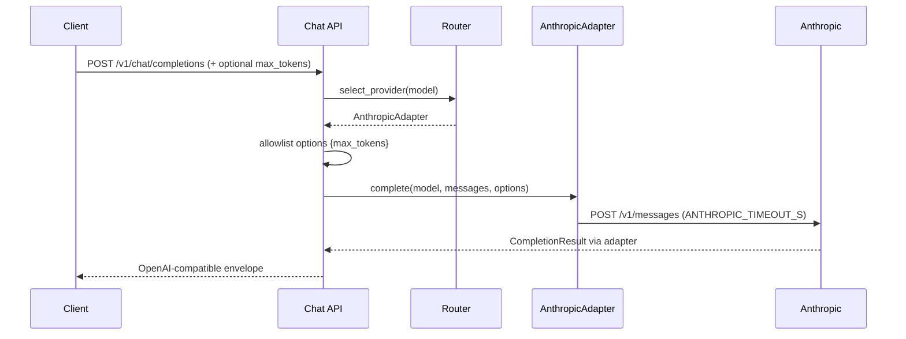

# Design: Anthropic Provider Adapter Slice

## Technical Approach

Add `AnthropicAdapter` behind ADR-0002's unchanged `ProviderAdapter` port. The adapter uses an injected `httpx.AsyncClient`, translates the existing OpenAI-compatible request to Anthropic Messages API, and joins the ordered registry, first-match/no-fallback router, telemetry timer, and lifespan ownership model. The API boundary will explicitly allow and forward `max_tokens`; all other arbitrary request extras remain accepted by Pydantic but are not provider options. No SDK, dependency, fallback, new ADR, or `ARCHITECTURE.md` change is required.

## Architecture Decisions

| Decision | Choice | Alternative / trade-off | Rationale |
|---|---|---|---|
| HTTP and timeout | Inject raw `httpx.AsyncClient`; add positive `ANTHROPIC_TIMEOUT_S` (default `30.0`) to `Settings`; `build_providers` passes it as `timeout_s`, and the adapter supplies it to the Messages POST | SDK or client-global timeout obscures the established boundary | Mirrors `OPENAI_TIMEOUT_S → OpenAIAdapter(timeout_s) → client.post(timeout=...)` and keeps tests deterministic. |
| Messages | Extract all `system` messages, join with `\n\n`, emit top-level `system`; retain ordered `user`/`assistant` messages | Rich blocks imply deferred multimodal/cache support | Matches the text-only spec; unsupported roles raise `ConfigurationError`. |
| Public options | Add validated optional `max_tokens` to `ChatCompletionRequest`; a small allowlist helper returns only non-`None` admitted fields and `post_chat_completion` passes that mapping to `adapter.complete(...)` | Forwarding `model_extra` is flexible but leaks arbitrary fields and reserved routing data | Deterministically forwards `max_tokens` without forwarding `model`, `messages`, `stream`, or unknown extras. Omission passes no override, so Anthropic defaults to `1024`. |
| Response | Join ordered text blocks; map only `end_turn → stop`, `max_tokens → length`, and `stop_sequence → stop` | Additional stop semantics are not admitted by the spec | Keeps normalization exactly within the current contract; non-text response blocks remain `UpstreamError` as specified. |
| Health and ownership | Unauthenticated `GET {base_url}/`; one factory-created client per provider, owned and closed exactly once by the registry | Auth probing consumes quota; shared clients blur rollback ownership | Preserves reachability-only health, transaction-like cleanup, and caller-owned `RegistryEntry(client=None)`. |

## Data Flow

Startup remains `Settings → build_providers → ProviderRegistry → app.state.providers`; failure closes all previously created clients and publishes no partial registry. Shutdown remains `registry.aclose() → shutdown_tracer()`.

## Interfaces / Contracts

- Anthropic request: `x-api-key`, `anthropic-version`, `model`, translated `messages`, optional `system`, and `max_tokens` (caller override or `1024`).
- Public option forwarding: allowlist is initially `{max_tokens}`; unknown extras are ignored, not forwarded. Existing `stream=true` short-circuit remains before routing/telemetry.
- Response: text content, model, usage counts, and the three admitted stop mappings become `CompletionResult` and an OpenAI-shaped envelope.
- Errors remain sanitized: timeout → 504; transport/HTTP/malformed/non-text output → 502. No upstream body, new error class, retry, or fallback.

## File Changes

| File | Action | Description |
|---|---|---|
| `src/llmux/core/providers/anthropic.py` | Create | Translation, timeout use, health, models, typed errors. |
| `src/llmux/config.py` | Modify | Anthropic key/base/version/models/timeout and fail-fast validation. |
| `src/llmux/core/providers/registry.py` | Modify | Ordered Anthropic construction and unchanged ownership. |
| `src/llmux/api/chat.py` | Modify | Validate and allowlist `max_tokens`; pass options to `complete`. |
| `.env.example` | Modify | Document `ANTHROPIC_*`, including timeout. |
| `tests/test_provider_routing_slice.py` | Modify | Adapter, registry, live-ASGI, lifecycle, and telemetry coverage. |

## Testing Strategy

| Layer | What | Approach |
|---|---|---|
| Unit | Wire shape, default/override, exactly three stop mappings, timeout, errors, health | `MockTransport`; RED tests precede adapter changes. |
| Integration | Config/timeout construction, ordered registry, cleanup and exactly-once close | Settings plus injected/counting clients. |
| Live ASGI | `max_tokens: 512` reaches Anthropic; omission emits `1024`; 200/400/502/504/501; no fallback; bounded telemetry | Lifespan-enabled ASGI client and captured outbound JSON. |

Run pytest at 90% coverage, Ruff, and mypy.

## Threat Matrix

| Boundary | Applicability | Design response | Planned RED tests |
|---|---|---|---|
| Documentation-like paths | N/A — no executable classification | None | None |
| Git repository selection | N/A — no Git execution | None | None |
| Commit state | N/A — no commit automation | None | None |
| Push state | N/A — no push automation | None | None |
| PR commands | N/A — delivery plan executes no PR commands | None | None |

Runtime provider routing is applicable: safe behavior is ordered first-match selection; selection failure returns 400 without invocation, retry, or failover. Existing router plus live-ASGI RED tests cover both boundaries.

## Migration / Rollout

No migration. Two-PR feature-branch chain under 400 authored lines each: **PR1 ~350** adds settings, adapter, env, and unit tests; **PR2 ~290** adds registry activation, `src/llmux/api/chat.py` option forwarding, and integration/live-ASGI/lifecycle/telemetry tests. Revert PR2 then PR1 for OpenAI-only behavior.

## Open Questions

None blocking.
