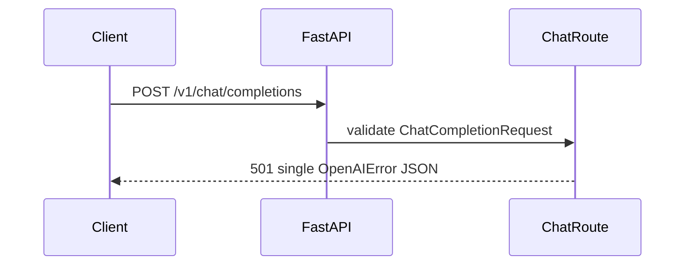

# Design: Core Gateway MVP

## Technical Approach

Build a stateless Python 3.12/FastAPI modular-monolith slice: a factory mounts three `/v1` routes, Pydantic v2 locks HTTP contracts, and an ADR-0002 port defines future providers. `uv` owns execution; persistence, auth, routing, and provider I/O remain absent.

## Architecture Decisions

| Option | Trade-off | Decision |
|---|---|---|
| Factory and route modules vs one global module | Wiring overhead; deterministic injection/tests | `create_app(settings=None)` plus exported `app` |
| Pydantic HTTP models; frozen/slotted dataclasses internally | Two model families; prevents transport types leaking into the port | Use each at its boundary |
| Structural `Protocol` vs ABC/plugin system | Runtime enforcement is limited; future adapters avoid inheritance/plugin machinery | ADR-0002 `ProviderAdapter` |
| Explicit OTel builder vs automatic instrumentation | No request spans yet; startup stays inert without configuration | Build/export only when OTLP endpoint exists |

## Project Structure / File Changes

| File | Action | Description |
|---|---|---|
| `pyproject.toml`, `uv.lock`, `ruff.toml`, `.env.example` | Create | Python 3.12 package, locked dependencies, quality/config contract |
| `src/llmux/{main.py,config.py}` | Create | Factory, settings, router/telemetry wiring |
| `src/llmux/api/{health.py,models.py,chat.py}` | Create | Typed routes and schemas |
| `src/llmux/core/providers/base.py` | Create | Protocol and normalized dataclasses |
| `src/llmux/observability/tracing.py` | Create | OTel construction/shutdown boundary |
| `tests/{conftest.py,api/test_*.py,core/test_provider_protocol.py}` | Create | Live-ASGI and contract tests |
| `.github/workflows/ci.yml` | Create | Frozen install, lint, types, tests |
| `CONTRIBUTING.md`, `openspec/config.yaml`, ADR-0001/0002 | Modify | Commands, strict TDD, accepted decisions |

`create_app` resolves `Settings`, stores it on `app.state`, mounts `/v1`, and owns OTel lifespan shutdown; exported `app = create_app()` supports Uvicorn. Settings map `LLMUX_HOST`, `LLMUX_PORT`, `LLMUX_VERSION`, `LLMUX_PROVIDERS_CONFIGURED`, `OTEL_SERVICE_NAME`, and optional `OTEL_EXPORTER_OTLP_ENDPOINT`. Without OTLP, no exporter starts; otherwise build an SDK provider, OTLP/HTTP exporter, and batch processor without capturing credentials or request content.

## Interfaces / Contracts

HTTP Pydantic models are: `ChatMessage(role: str, content: str | list[dict[str, object]] | None)` and `ChatCompletionRequest(model: str, messages: list[ChatMessage]` with at least one item, `stream: bool = False)`; both allow extra OpenAI fields. `OpenAIError(error: ErrorDetail)` wraps `ErrorDetail(message, type, param: str | None, code)`.

All internal dataclasses are `frozen=True, slots=True`: `CompletionResult(content, model, prompt_tokens, completion_tokens, finish_reason, raw=<empty-mapping factory>)`; `Chunk(delta, model, finish_reason=None)`; `ModelInfo(id, provider, supports_streaming)`; `HealthStatus(healthy, latency_ms=None, error=None)`.

`ProviderAdapter` declares `async complete(model, messages, options) -> CompletionResult`, `complete_stream(...) -> AsyncIterator[Chunk]` (a synchronous declaration returning an async iterator, avoiding a nested coroutine), `async models() -> list[ModelInfo]`, and `async health() -> HealthStatus`. Inputs use `Sequence[Mapping[str, object]]` and `Mapping[str, object]`.

| Endpoint | Exact behavior |
|---|---|
| `GET /v1/health` | `200 application/json`; `{"status":"ok","version":settings.version,"providers_configured":[...]}`; gateway-native |
| `GET /v1/models` | `200 application/json`; `{"object":"list","data":[]}` |
| `POST /v1/chat/completions` | Valid false/true/omitted `stream`: identical `501 application/json` body `{"error":{"message":"Chat completions are not implemented","type":"not_implemented_error","param":null,"code":"not_implemented"}}`; never SSE/chunked. Invalid input remains FastAPI `422` in this slice. |

## Requirement Traceability / Testing

| Spec requirement | Component | RED test |
|---|---|---|
| Gateway health | `health.py`, settings | 200, exact fields/types |
| OpenAI models | `models.py` | exact empty-list envelope |
| Chat 501 modes | `chat.py` | false/true/omitted equality; JSON, no `data:`/SSE |
| `/v1` mounting | `main.py` | all exact paths reachable |
| HTTP testability | `conftest.py` | TestClient exercises ASGI boundary |
| ProviderAdapter | `base.py` | four members; concrete stub instantiates |
| CompletionResult | `base.py` | required fields construct/read |
| Chunk | `base.py` | required fields construct/read |
| ModelInfo | `base.py` | required fields construct/read |
| HealthStatus | `base.py` | required fields construct/read |
| Provider contract testability | protocol test | imports, signatures, dataclasses; no adapter |

Strict RED→GREEN→REFACTOR applies per row. CI runs `uv sync --frozen`, `uv run ruff check .`, `uv run mypy src`, then `uv run pytest -q --cov=llmux --cov-fail-under=90`. Runtime dependencies: FastAPI, Uvicorn, pydantic-settings, OTel API/SDK and OTLP HTTP exporter. Dev: httpx, pytest, pytest-asyncio, pytest-cov, Ruff, mypy.

## Forecast

Target: ~380 authored lines (tooling 65, source 155, tests 110, CI/docs 50); generated `uv.lock` is excluded. Above 400, drop: `Dockerfile`, ADR status flips, then standalone pytest configuration (fold essentials into `pyproject.toml`). Never drop contracts, CI, types, or route/port behavior.

## Threat Matrix

HTTP routing triggers review; no reference process boundary applies:

| Boundary | Applicability | Safe/failure behavior | Planned RED tests |
|---|---|---|---|
| Documentation-like paths | N/A — no file classification/execution | Not accepted as executable input | None |
| Git repository selection | N/A — no Git invocation | No repository selector exists | None |
| Commit state | N/A — no commit automation | Index/worktree untouched | None |
| Push state | N/A — no push automation | No destination resolution | None |
| PR commands | N/A — no PR automation | No command composition | None |

## Migration / Rollout / Rollback

No migration or state. Deploy with OTLP unset; enable it after collector validation. Roll back by reverting the additive merge; no data recovery is needed.

## Open Questions

None.
