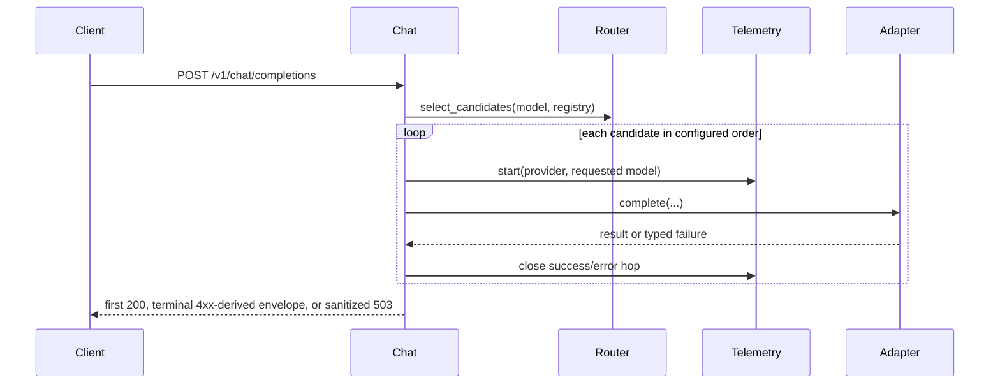

# Design: Provider Fallback Slice

## Technical Approach

Replace first-match routing with deterministic candidate discovery, then execute candidates sequentially at the chat API boundary. Selection remains exact-model and registry-ordered; typed errors drive fallback; sanitized envelopes and per-hop telemetry remain public boundaries. This implements both delta specs without changing adapters, registry ownership, configuration, or dependencies.

## Architecture Decisions

| Option | Trade-off | Decision and rationale |
|---|---|---|
| Return all matching adapters once | One small tuple; avoids repeated model scans | Replace `select_provider` with async `select_candidates`. `ProviderRegistry.providers` preserves configured order, satisfying the registry contract while removing the obsolete API. |
| Central pure retry classifier | Statusless `UpstreamError` also covers malformed responses | Add `is_retryable(LLMuxError)` in `errors.py`: timeout, status 408/429/≥500, or no status are retryable; other 4xx and typed errors are terminal. This centralizes policy without adapter churn. |
| Sequential cross-provider attempts | A timed-out generation may have completed upstream | Attempt each candidate exactly once, never concurrently. This deterministic chain excludes same-provider retry, backoff, health checks, breakers, aliases, and toggles. |
| Existing timer per attempt | `requests_total` counts attempts, not requests | Wrap each `complete` call in one `ChatCompletionTimer`. Existing metric descriptions define one hop, so no new instrument or attribute is needed. |
| Dedicated exhausted error | Retryable single-provider failures become 503 | Add sanitized `AllProvidersFailedError` with 503, `api_error`, code `all_providers_failed`, and a safe class message, matching `ARCHITECTURE.md`. |

## Data Flow



`stream=true` returns 501 before selection or telemetry. A selection miss retains 400 and one bounded `provider=none`, `model=unknown` error hop. Retryable failures continue; terminal `LLMuxError` returns immediately; unexpected exceptions keep the bounded `internal_error` hop and propagate as 500. Exhaustion adds no synthetic hop because every attempt is recorded.

## File Changes

| File | Action | Description |
|---|---|---|
| `src/llmux/core/router.py` | Modify | Replace `select_provider` with ordered `select_candidates`. |
| `src/llmux/core/errors.py` | Modify | Add retry classification and sanitized 503 error. |
| `src/llmux/api/chat.py` | Modify | Select once; execute the sequential attempt loop and preserve short-circuits/envelopes. |
| `tests/test_provider_routing_slice.py` | Modify | Cover candidate selection, failure matrix, attempt order/count, envelopes, telemetry, and lifecycle regressions. |
| `src/llmux/observability/metrics.py` | No change | Existing per-hop timer and bounded labels already satisfy the contract. |
| `src/llmux/core/providers/registry.py` | No change | Candidate references do not transfer ownership; lifespan still closes each owned client once after serving. |

## Interfaces / Contracts

```python
async def select_candidates(model: str, registry: ProviderRegistry) -> tuple[ProviderAdapter, ...]
def is_retryable(error: LLMuxError) -> bool

class AllProvidersFailedError(LLMuxError):
    status_code = 503
    code = "all_providers_failed"
    error_type = "api_error"
```

Empty candidates raise `ProviderSelectionError`. Adapters receive unchanged model, messages, and allowlisted options. Adapter and registry lifecycle contracts remain unchanged.

## Testing Strategy

| Layer | What to Test | Approach |
|---|---|---|
| Unit | Candidate filtering/order; classifier matrix | Async router tests plus parametrized timeout, 408, 429, 5xx, statusless, other-4xx, and non-upstream cases. |
| Integration | First-success, exact-once order, terminal stop, exhaustion 503 | Existing FastAPI/TestClient and provider doubles; assert no duplicate/concurrent calls and sanitized bodies. |
| Observability/lifecycle | One per-attempt hop; bounded attributes; no exhaustion hop; clients open during attempts and close once at lifespan exit | Existing in-memory OTel exporters and registry fixtures. Preserve stream 501/no telemetry and selection-miss 400 coverage. |

## Threat Matrix

Routing changes require this matrix; its executable-path and VCS/process boundaries are untouched.

| Boundary | Applicability | Safe/failure behavior | Planned RED tests |
|---|---|---|---|
| Documentation-like paths | N/A — no file classification or execution | Existing behavior unchanged | N/A |
| Git repository selection | N/A — no Git/cwd handling | Existing behavior unchanged | N/A |
| Commit state | N/A — no commit/index automation | Existing behavior unchanged | N/A |
| Push state | N/A — no push/ref resolution | Existing behavior unchanged | N/A |
| PR commands | N/A — no command composition | Existing behavior unchanged | N/A |

## Migration / Rollout

No migration, flag, dependency, or configuration change. Fallback is default when configured providers share an exact model id. Revert the slice to roll back; single-provider configuration limits the chain to one candidate.

## Open Questions

None. Statusless errors also retry malformed responses because adapters use statusless `UpstreamError` for transport and parsing failures; taxonomy refinement is outside this slice.
